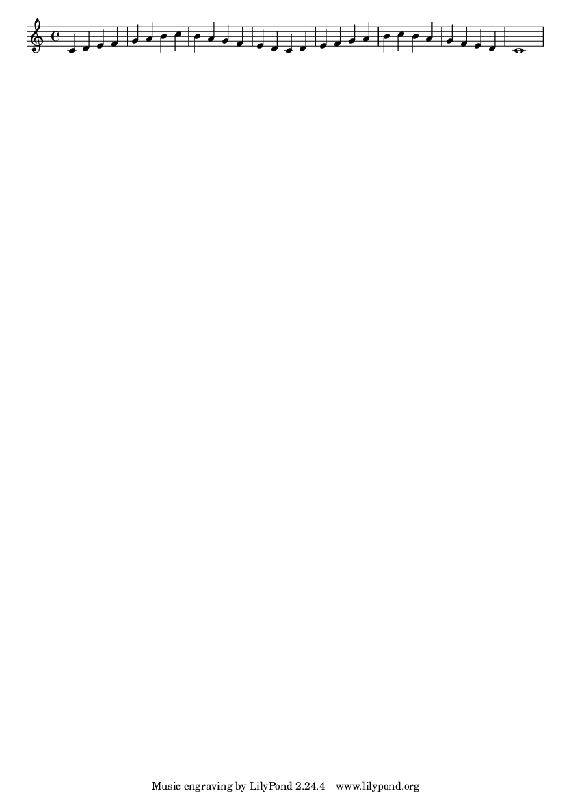
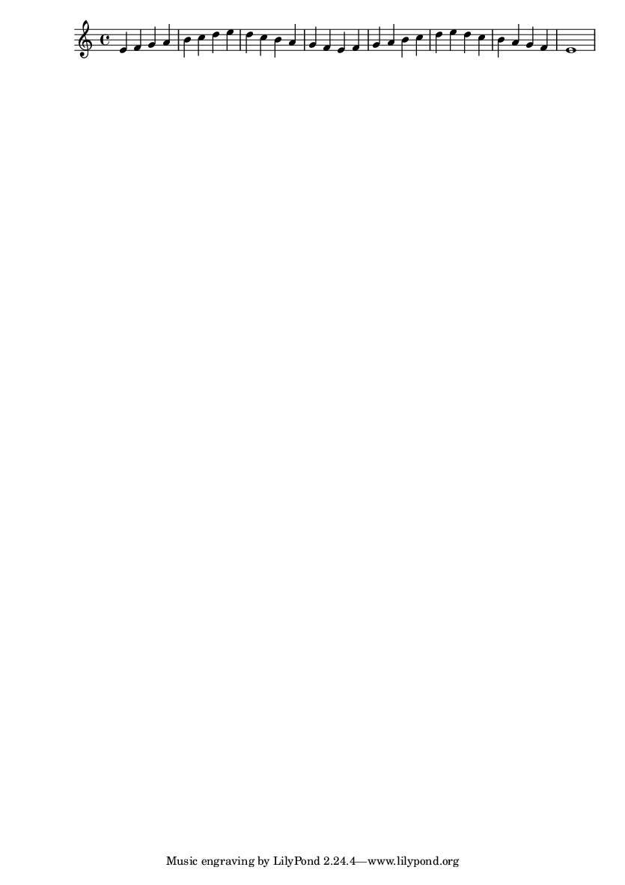

#+TITLE: Modes in the Key of C
#+DATE:
#+OPTIONS: timestamp:nil num:nil toc:nil 
#+LaTeX_HEADER: \usepackage[cm]{fullpage}
* Ionian Mode
Lorem ipsum dolor sit amet, consectetur adipiscing elit. Phasellus porta ipsum a enim commodo mollis. 
#+LaTeX: \linebreak
#+ATTR_LaTeX: width=17cm 
#+begin_src lilypond :file ionian.png :noweb yes
  \version "2.24.4"
  tagline = "Bartev 2024-12"
  copyright = #"BJV 2024"
  \paper{
    %% clip-regions = #'()
    indent = 0 % remove indentation
    %% bookTitleMarkup=##f
    %% scoreTitleMarkup=##f
    print-pages = ##f
  }

  \layout {
    ragged-right = ##f
    ragged-last-bottom = ##t
    ragged-bottom = ##t
    tagline = ##t
  }

  \relative c' { 
    c d e f g a b c b a g f e d c d  
    e f g a b c b a g f e d c1
  }
#+end_src

#+results[0c21e5c5bd30d880d2bd230aa09b7613c2554835]:

* Dorian Mode
Lorem ipsum dolor sit amet, consectetur adipiscing elit. Phasellus porta ipsum a enim commodo mollis. Praesent eleifend turpis sed mi accumsan eget fringilla odio malesuada. Mauris justo nibh, aliquam eget egestas eu, eleifend id enim. Maecenas sed arcu vel ligula consectetur porttitor dapibus at enim. Sed eu urna vel diam dignissim tempus. Sed in tortor turpis, eget commodo eros. Duis in elementum magna. Sed bibendum mattis leo, vel rutrum odio facilisis iaculis. Vestibulum odio tortor, vehicula eu tempor sit amet, ultrices eu mi. Integer accumsan lacus a leo mattis pretium. Proin velit quam, vestibulum at porttitor vel, fringilla a est.
#+LaTeX: \linebreak
#+ATTR_LaTeX: width=17cm
#+begin_src lilypond :file dorian.png  :noweb yes
  
    <<version-and-paper>>
    \relative c' { 
      d e f g a b c d c b a g f e d e 
      f g a b c d c b a g f e d1
  }
#+end_src

#+results[22b4b6d96bf6829d5fdf36d22fda3d559b225b11]:

* Phrygian Mode
Lorem ipsum dolor sit amet, consectetur adipiscing elit. Phasellus porta ipsum a enim commodo mollis. Praesent eleifend turpis sed mi accumsan eget fringilla odio malesuada. Mauris justo nibh, aliquam eget egestas eu, eleifend id enim. Maecenas sed arcu vel ligula consectetur porttitor dapibus at enim. Sed eu urna vel diam dignissim tempus. Sed in tortor turpis, eget commodo eros. Duis in elementum magna. Sed bibendum mattis leo, vel rutrum odio facilisis iaculis. Vestibulum odio tortor, vehicula eu tempor sit amet, ultrices eu mi. Integer accumsan lacus a leo mattis pretium. Proin velit quam, vestibulum at porttitor vel, fringilla a est.
#+LaTeX: \linebreak
#+ATTR_LaTeX: width=17cm
#+begin_src lilypond :file phrygian.png  :noweb yes

  <<version-and-paper>>
  \relative c' { 
    e f g a b c d e d c b a g f e f
    g a b c d e d c b a g f e1
}
#+end_src

#+results:

#+name: version-and-paper()
#+begin_src lilypond
  \version "2.24.4"
  \paper{
    output-format = eps
    system-system-spacing = #'((basic-distance . 0) (minimum-distance . 0) (padding . 0))
    clip-regions = #'()
    indent = 0 % remove indentation
    ragged-right = ##f
    ragged-last-bottom = ##t
    ragged-bottom = ##t
    tagline = ##f
    %% line-width=170\mm
    %% oddFooterMarkup=##f
    %% oddHeaderMarkup=##f
    bookTitleMarkup=##f
    scoreTitleMarkup=##f
    print-pages=##f
  }
#+end_src

